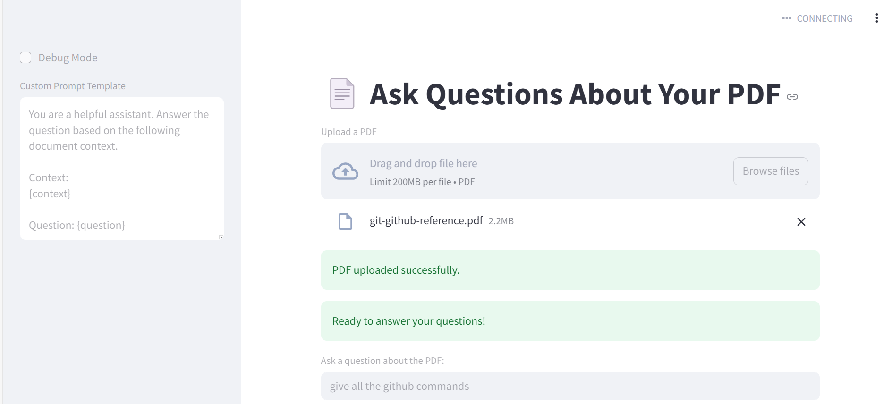

# 📚 PDF Question-Answering Chatbot

A smart chatbot that lets users upload PDF files and ask questions. Powered by Python, Streamlit, and Gemini API.

## 🚀 Features
- 📄 Upload any PDF file
- 🤖 Ask questions based on the PDF content
- 🔍 Intelligent, context-aware answers using Gemini
- ⚡ Fast, interactive, and user-friendly interface
- 💬 Chat-based UI for a seamless experience

## 🛠️ Tech Stack
- **Frontend:** Streamlit (Python)
- **Backend:** Python + Gemini API
- **PDF Parsing:** PyMuPDF / pdfplumber
- **NLP Engine:** Gemini (Google AI)
- **Optional:** FAISS / Chroma / Pinecone for vector DB
- **Deployment:** Streamlit / Render / HuggingFace Spaces

## 📸 Screenshot


## 📦 Installation

```bash
git clone https://github.com/yourusername/pdf-gemini-chatbot.git
cd pdf-gemini-chatbot
python -m venv venv
source venv/bin/activate  # On Windows: venv\Scripts\activate
pip install -r requirements.txt
streamlit run app.py
