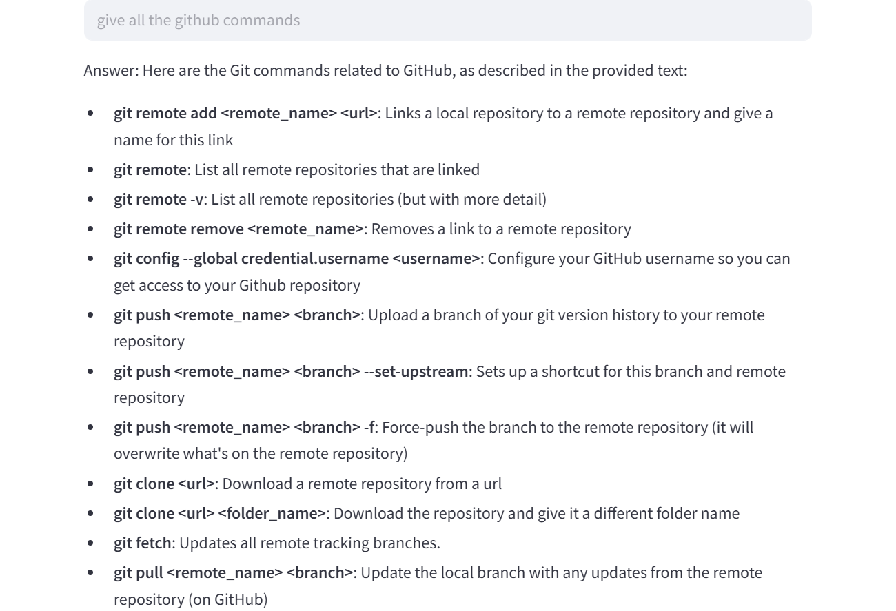

<!DOCTYPE html>
<html lang="en">
<head>
  <meta charset="UTF-8" />
  <meta name="viewport" content="width=device-width, initial-scale=1.0"/>
  <title>PDF Question-Answering Chatbot</title>
  
</head>
<body>

  <h1>📚 PDF Question-Answering Chatbot using Gemini API</h1>
  
A smart, AI-powered chatbot that enables users to upload any PDF file and ask context-aware questions related to the content. Built with Python, Streamlit, and Gemini API, this chatbot reads and understands complex documents, making it a powerful tool for document analysis and assistance.

  

    <h2>🚀 Features</h2>
    <ul>
      <li>📄 Upload any PDF file</li>
      <li>🤖 Ask questions based on the PDF content</li>
      <li>🔍 Gemini-powered contextual understanding and intelligent answers</li>
      <li>⚡ Fast and interactive user interface using Streamlit</li>
      <li>💬 Chat-based UI for a seamless Q&A experience</li>
    </ul>
  

  

    <h2>🛠️ Tech Stack</h2>
    <ul>
      <li><strong>Frontend & Deployment:</strong> Streamlit</li>
      <li><strong>Backend & Logic:</strong> Python</li>
      <li><strong>PDF Parsing:</strong> PyMuPDF / pdfplumber</li>
      <li><strong>NLP Engine:</strong> Google Gemini API</li>
      <li><strong>Optional:</strong> FAISS / Chroma / Pinecone for vector DB support</li>
    </ul>
  

  

    <h2>📸 Screenshot</h2>
    
    
    <!-- Replace "screenshot.png" with your actual file name -->
  

  

    <h2>📦 Installation & Usage</h2>
    <pre><code># Clone the repository
git clone https://github.com/my-username/pdf-gemini-chatbot.git
cd pdf-gemini-chatbot

# Create and activate virtual environment
python -m venv venv
source venv/bin/activate  # On Windows: venv\Scripts\activate

# Install dependencies
pip install -r requirements.txt

# Run the Streamlit app
streamlit run app.py</code></pre>
  

  <h2>🔐 API Key Setup</h2>
  <pre><code># In a .env file:
GEMINI_API_KEY=your_key_here</code></pre>

 

</body>
</html>

